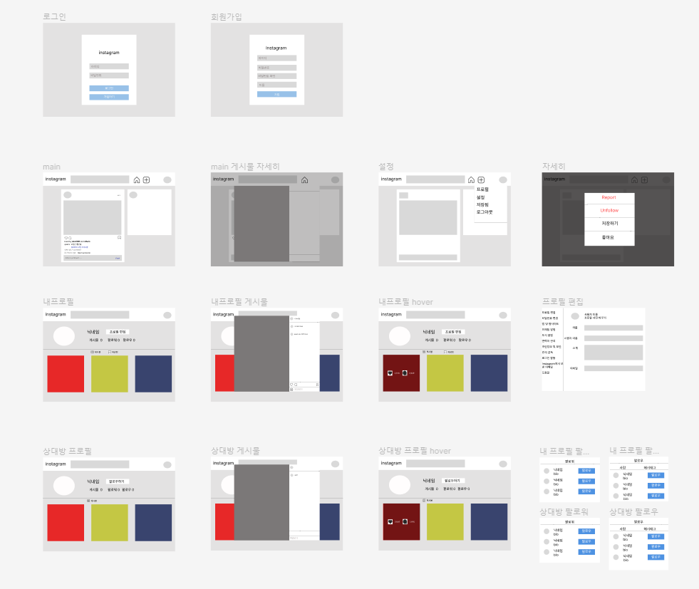

# e1i4 insta clone coding project repo #  
  

## 🏠 소개

인스타 클론 코딩 팀 프로젝트

인스타그램을 django를 활용하여 비슷하게 구현하는 프로젝트

서비스의 목적 : SNS 서비스인 인스타그램의 기능을 최대한 비슷하게 구현  

[서비스 시연 영상](https://woong-garden.tistory.com/entry/2-%EC%83%88%EC%8B%B9%EC%9D%B4%EC%9D%98-%ED%94%84%EB%A1%9C%EC%A0%9D%ED%8A%B8-Django-%EC%9D%B8%EC%8A%A4%ED%83%80-%ED%81%B4%EB%A1%A0-%EC%BD%94%EB%94%A9)
  

## ⏲️ 개발기간
2022년 9월 30일 ~ 2022년 10월 6일  
  

## 🧙 멤버구성
백엔드
[고은혜](https://github.com/gracegoh924), 
[김남훈](https://github.com/nhkmi1001), 
[오형석](https://github.com/auberr), 
[전다솔](https://github.com/0sol0)

프론트
[나웅주](https://github.com/woong-garden)
  

## 📝 공통 문서

* __화면기획서(Wireframe)__ 

  

## ⚙️ 개발 환경
* Framework : Django  
  

## 📌 서비스의 기능

1. 회원 가입
2. 로그인
3. 로그아웃
4. 메인 이동
5. 게시글 작성 조회 수정 삭제
6. 댓글 작성 조회 수정 삭제
7. 좋아요, 팔로우, 언팔로우
8. 내 프로필, 내 게시물만 보기, 팔로우 팔로워 보기, 저장 게시물 확인, 내 프로필 수정
9. 다른 사람 프로필, 다른 사람 게시물만 보기, 팔로우 팔로워 보기
