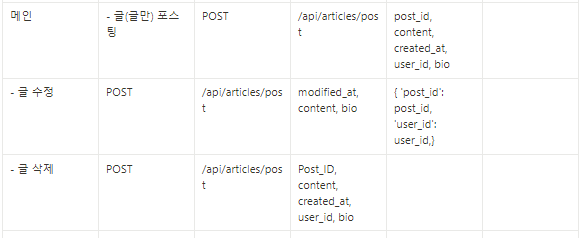
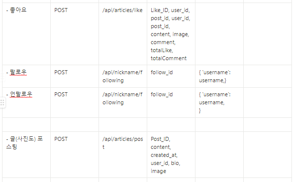
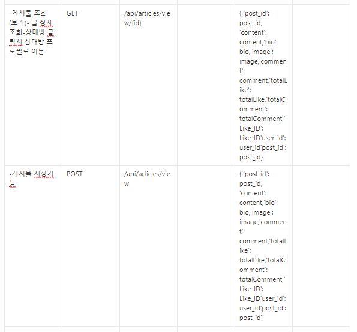
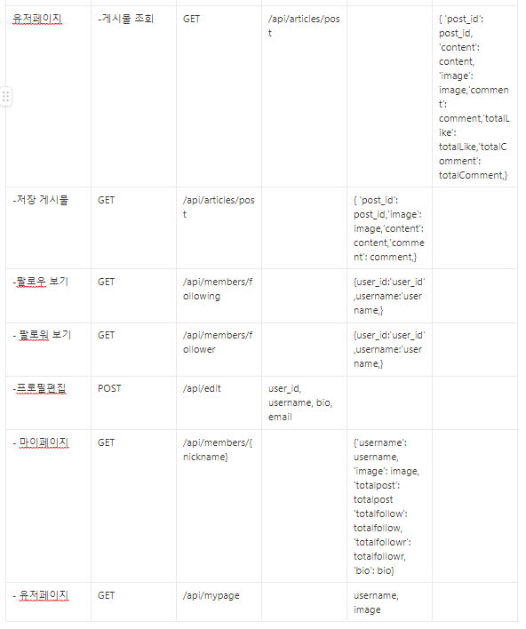

# e1i4 insta clone coding project repo #  
  

## 🏠 소개

인스타 클론 코딩 팀 프로젝트

인스타그램을 django를 활용하여 비슷하게 구현하는 프로젝트

서비스의 목적 : SNS 서비스인 인스타그램의 기능을 최대한 비슷하게 구현  

[서비스 시연 영상](https://youtu.be/e8iRvcSg-mA)
  

## ⏲️ 개발기간
2022년 9월 30일 ~ 2022년 10월 6일  
  

## 🧙 멤버구성
[고은혜](https://github.com/gracegoh924), [김남훈](https://github.com/nhkmi1001), [나웅주](https://github.com/woong-garden), [오형석](https://github.com/auberr), [전다솔](https://github.com/0sol0)
  

## 📝 공통 문서

* __화면기획서(Wireframe)__ [상세보기](https://www.figma.com/proto/kPn3gSrv4c8r1tIW7zXEZY/e1i4_instaclone_wireframe_v1.0?node-id=5%3A208&scaling=min-zoom&page-id=0%3A1&starting-point-node-id=5%3A208)

* __ERD(Entity Relationship Diagram)__ [상세보기 - WIKI 이동](https://github.com/auberr/project_e1i4_insta_clone/wiki/ERD)

* __API(Application Programming Interface)__ [상세보기](https://docs.google.com/spreadsheets/d/1MLNpDRrXkBEfHgwunWxZxYNU6JZDrj47iCOTlf0Tf5s/edit?usp=sharing)  

  

## ⚙️ 개발 환경
* Framework : Django  
  

## 📌 서비스의 기능

1. 회원 가입
2. 로그인
3. 로그아웃
4. 메인 이동
5. 해시태그 생성, 보기
6. 게시글 작성 조회 수정 삭제
7. 댓글 작성 조회 수정 삭제
8. 좋아요, 팔로우, 언팔로우
9. 내 프로필, 내 게시물만 보기, 팔로우 팔로워 보기, 저장 게시물 확인, 내 프로필 수정
10. 다른 사람 프로필, 다른 사람 게시물만 보기, 팔로우 팔로워 보기
11. 기타 등등
